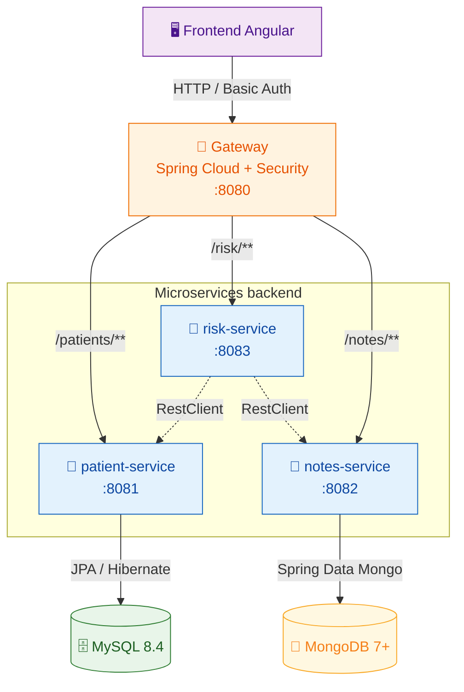

# OpenClassrooms - Cursus Dev Java

Ce projet à été créé dans le cadre de ma formation **Développeur d'application Java** dispensée par [OpenClassrooms](https://openclassrooms.com/)

## Contexte

> ### Étudiant : **Franck Mounier**
>
> ### Projet : P9 - Développez une solution en microservices
>
> ### Type : Livrable
>
> #### Repo source : _empty project_
>
> #### Date de démarrage du projet : 21/05/2026

---

<div align="center">


# Médilabo Solutions

_« We care for you »_

[](https://adoptium.net/)
[](https://spring.io/projects/spring-boot)
[](https://spring.io/projects/spring-cloud)
[](https://www.docker.com/)
[]()

</div>

## À qui s'adresse ce projet

**Médilabo Solutions** est une application interne destinée aux **cliniques de santé** (client fictif : Abernathy Clinic, CTO Ramesh Eliot, Product Owner Taylor Waters).

Elle vise spécifiquement les **praticiens** qui doivent :

- gérer les **données démographiques** de leurs patients (sprint 1)
- consulter et enrichir l'**historique des notes médicales** d'un patient (sprint 2)
- obtenir un **rapport automatisé du risque de diabète de type 2** par patient (sprint 3)

Le système n'est pas destiné au grand public ni aux patients eux-mêmes — l'authentification est centralisée sur une gateway et limitée au personnel praticien.

## Démarrage rapide

> ⚠️ **Statut actuel** : sprint 0 terminé (scaffold + documentation). Endpoints fonctionnels et orchestration Docker à venir au sprint 1.

### Prérequis

- **Java 25 LTS** ([Eclipse Temurin](https://adoptium.net/temurin/releases/?version=25) recommandé)
- **Docker Desktop** (ou équivalent) + Docker Compose
- **Git**
- **Node.js 20+** + **npm** _(à partir de la fin du sprint 1, pour le frontend Angular)_

### Démarrage d'un service en isolation (dev)

```bash
cd patient
./mvnw spring-boot:run
```

### Démarrage complet via Docker Compose (à venir)

```bash
docker compose up --build
# Frontend : http://localhost
# Gateway API : http://localhost:8080
```

### Ouverture VS Code multi-root

```bash
code medilabo.code-workspace
```

→ Les 4 services Java s'ouvrent côte à côte avec leurs propres language servers, plus la racine pour `docker-compose.yml` et `README.md`.

## Stack technique

| Couche                          | Techno                                                               | Version                    |
| ------------------------------- | -------------------------------------------------------------------- | -------------------------- |
| Runtime Java                    | **OpenJDK Temurin**                                                  | **25 LTS**                 |
| Microservices                   | **Spring Boot**                                                      | **4.0.6**                  |
| Gateway (réactif)               | **Spring Cloud Gateway**                                             | **2025.1.1** _« Oakwood »_ |
| Sécurité                        | **Spring Security** (HTTP Basic Auth + `InMemoryUserDetailsManager`) | aligné Boot 4              |
| BDD relationnelle               | **MySQL Community**                                                  | **8.4 LTS**                |
| BDD NoSQL                       | **MongoDB Community**                                                | 7+                         |
| Schéma SQL                      | DDL versionné dans `patient/src/main/resources/db/*.sql`             | —                          |
| Client HTTP inter-microservices | **`RestClient`** (Spring 6.1+, impératif)                            | aligné Boot 4              |
| Build                           | **Maven Wrapper** (`./mvnw`)                                         | 3.9+                       |
| Frontend                        | **Angular standalone**                                               | 20+ _(à venir)_            |
| Conteneurisation                | **Docker** + **Docker Compose**                                      | dernière stable            |

> Toutes les décisions techno sont tracées au format **ADR (Architecture Decision Records)** — voir la section _Documentation_.

## Endpoints REST

> 🔜 **Section à compléter au sprint 1** (premiers endpoints CRUD `patient-service`).

Vue d'ensemble cible :

| Méthode | Endpoint (via gateway `:8080`) | Service cible | Description                       |
| ------- | ------------------------------ | ------------- | --------------------------------- |
| `GET`   | `/patients`                    | patient       | Liste paginée des patients        |
| `GET`   | `/patients/{id}`               | patient       | Détail d'un patient               |
| `POST`  | `/patients`                    | patient       | Création d'un patient             |
| `PUT`   | `/patients/{id}`               | patient       | Mise à jour d'un patient          |
| `GET`   | `/notes/patient/{id}`          | notes         | Historique des notes d'un patient |
| `POST`  | `/notes`                       | notes         | Ajout d'une note praticien        |
| `GET`   | `/risk/{patientId}`            | risk          | Rapport de risque diabète         |

Toutes les routes sont protégées par **HTTP Basic Auth** au niveau de la gateway. Les microservices internes ne refont pas la vérification (réseau Docker privé).

## Pipeline CI/CD

> 🔜 **Section à compléter** (workflows GitHub Actions au sprint 1).

Cibles prévues :

- ✅ **Build Maven** par service (`./mvnw verify`)
- ✅ **Tests unitaires + intégration** (JUnit 5 + Mockito + `@SpringBootTest`)
- 🔜 **Build images Docker** + push registry (selon contexte de soutenance)
- 🔜 **Analyse statique** : SonarCloud ou équivalent
- 🔜 **Dependency scan** : OWASP Dependency-Check

## Documentation

- **Hub Notion projet** : ADR-01 à ADR-08, cheat sheets Initializr, checklist post-bootstrap, workflow Git _(accès restreint)_
- **Diagrammes Mermaid** :
    - [`docs/diagrams/architecture-cible.mmd`](docs/diagrams/architecture-cible.mmd) — vue microservices + flux REST
    - [`docs/diagrams/mcd-mld.mmd`](docs/diagrams/mcd-mld.mmd) — modèle conceptuel et logique des données

### Architecture en bref



> **Légende des flèches** : solides = appels externes routés via la gateway · pointillées = appels REST internes service-à-service (`RestClient`).
>
> 📐 **Version étendue** (subgraphs, annotations supplémentaires, code couleur enrichi) : [`docs/diagrams/architecture-cible.mmd`](docs/diagrams/architecture-cible.mmd).

## Structure du dépôt

```
medilabo-solutions/                  ← monorepo Git
├── gateway/                         Spring Cloud Gateway + Spring Security
├── patient/                         CRUD patients (MySQL — table unique)
├── notes/                           Historique notes praticien (MongoDB)
├── risk/                            Calcul du niveau de risque diabète
├── frontend/                        SPA Angular (à venir)
│
├── docs/diagrams/                   Diagrammes Mermaid (.mmd)
│
├── docker-compose.yml               Orchestration globale (à venir)
├── medilabo.code-workspace          Config VS Code multi-root
├── .env.example                     Template variables sensibles (à venir)
├── .gitignore                       Cross-service
└── README.md                        Ce fichier
```

> 💡 **Chaque microservice est un projet Maven autonome** — pas de POM parent au niveau racine. C'est un choix architectural conscient (cf. _Architecture du monorepo_ dans le hub Notion). Un service peut être extrait dans son propre repo Git sans modification.

## 🌱 Green Code

Démarche d'éco-conception adossée au **RGESN 2024** (Arcep/Arcom, en lien avec l'ADEME et en collaboration avec la DINUM, l'Inria et la CNIL — 78 critères) et complétée par le **RWEB v5** (Collectif GreenIT, juin 2025).

**Méthode retenue : mesurer avant de décider.** Chaque levier a été relevé avant et après application. Ceux qui ne paient pas ont été **écartés et documentés comme tels** — ils sont quatre, et ils valent autant que ceux qui ont été retenus.

### Leviers appliqués

| Levier | Effet mesuré | RGESN |
| ------ | ------------ | ----- |
| **`performance_schema` désactivé** sur MySQL — instrumentation interne que rien n'exploite ici | **467,6 → 221,5 Mo** (−53 %), marge avant OOM de 44 à 290 Mo | 8.x |
| **Bornage `mem_limit` / `cpus`** sur les 7 conteneurs | Rend effectif le `-XX:MaxRAMPercentage=75` des Dockerfiles, jusque-là calculé sur la RAM de l'hôte entier | 8.x |
| **Sobriété des logs** — sonde Mongo espacée, banners Spring coupés, driver Mongo en `WARN` | **522 → 216 lignes, 143 → 43,8 Ko** par cycle de démarrage (−70 %) | 7.x / 8.x |
| **Cache navigateur** — `immutable` sur les assets hashés, `no-cache` sur `index.html` | Supprime la requête de revalidation, pas seulement son corps | 7.x |
| **Polices auto-hébergées** (Roboto latin 400/500) et **icon font supprimée** | Retire 2 connexions tierces ; l'icon font n'était référencée nulle part | 7.x |
| **Compression gzip** des réponses texte et JSON (nginx) | JSON de l'API : **−46 à −49 %** ; bundle principal : 373 → **131 Ko** | **7.2** |
| **Pagination `Pageable`** sur la liste des patients | Traduit en `LIMIT` SQL — jamais de `findAll()` non borné | — |
| **Lazy loading** des routes Angular (`loadComponent`) | 6 chunks chargés à la demande, pas au premier écran | — |
| **Index Mongo sur `patId`** + tri côté serveur | Pas de chargement complet suivi d'un tri en mémoire | — |
| **Images Docker multi-stage** (`eclipse-temurin:25-jre-alpine`, `nginx:alpine`) | Frontend **93,7 Mo**, services Java 346 à 417 Mo | 8.x |
| **DevTools et Lombok exclus** des JAR de production | Coût runtime nul en production | 8.x |
| **`ddl-auto: validate`** + DDL versionné à la main | Aucun DDL automatique au démarrage | — |

### Optimisations écartées — sur mesure, pas par principe

| Écartée | Motif |
| ------- | ----- |
| **Compression sur la gateway** | Le navigateur passe par nginx, qui compresse déjà le JSON : le critère 7.2 est rempli. L'ajouter ne compresserait que le tronçon gateway → nginx, **interne au réseau Docker**. |
| **Cache serveur `LocalResponseCache`** (critère 7.1, **non retenu**) | La boucle métier est *ajouter une note → recharger l'historique → recharger le risque*. Un cache à TTL servirait ces lectures périmées ~100 ms après l'écriture. De plus `POST /notes` périme aussi `/risk/{id}` — invalider correctement supposerait d'inscrire cette règle métier dans la gateway. |
| **Pagination des notes d'un patient** | Le `risk-service` concatène **l'historique complet** pour compter les termes déclencheurs. Paginer le ferait sous-compter (donc afficher un mauvais niveau de risque), ou l'obligerait à itérer toutes les pages pour le même volume transféré. |
| **Buffer pool InnoDB réduit à 64 Mo** | **4,4 Mo économisés** seulement — MySQL 8 alloue le pool paresseusement — au prix de la marge de cache en lecture. Ressemble à du green code, n'en est pas. |

### Mesures

| Indicateur | Valeur |
| ---------- | ------ |
| Empreinte mémoire de la stack au repos | **1,15 Gio** sur une VM de 3,83 Gio |
| Logs produits par un cycle démarrage + test | **216 lignes / 43,8 Ko** |
| Bundle front transféré (gzip) | `main` **131 Ko**, CSS 1,9 Ko, polices 2 × 22 Ko |
| Poids total des assets disponibles | **286 Ko**, dont 6 chunks chargés à la demande |
| Réponses JSON de l'API | 163 à 777 octets, compressées |

### Limites assumées

- **Aucun label RGESN n'existe** à ce jour : la démarche est volontaire et déclarative. Il ne s'agit pas d'une certification.
- Les outils EcoIndex et GreenIT-Analysis mesurent une **page web rendue** : ils ne s'appliquent pas au backend Java. Les leviers backend ont donc été mesurés directement (`docker stats`, volume de logs, taille des réponses).
- Le dimensionnement est celui d'un projet de formation : la somme des `mem_limit` (3,13 Gio) dépasse ce que la VM peut honorer simultanément. Ce sont des **garde-fous par conteneur**, pas un plan de capacité.
- Pas d'analyse de cycle de vie, ni d'hébergement chez un fournisseur bas-carbone.

### Suites identifiées

Auto-évaluation **NumEcoDiag** contre les 78 critères du RGESN, mesure **EcoIndex** de la page principale, et compilation native GraalVM pour réduire l'empreinte des JVM.
