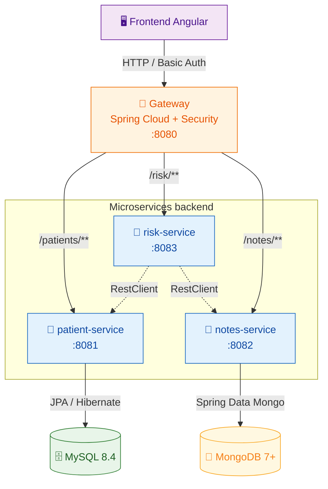

# OpenClassrooms - Cursus Dev Java

Ce projet à été créé dans le cadre de ma formation **Développeur d'application Java** dispensée par [OpenClassrooms](https://openclassrooms.com/)

## Contexte

> ### Étudiant : **Franck Mounier**
>
> ### Projet : P9 - Développez une solution en microservices
>
> ### Type : Livrable
>
> #### Repo source : _empty project_
>
> #### Date de démarrage du projet : 21/05/2026

---

<div align="center">


# Médilabo Solutions

_« We care for you »_

[](https://adoptium.net/)
[](https://spring.io/projects/spring-boot)
[](https://spring.io/projects/spring-cloud)
[](https://www.docker.com/)
[]()

</div>

## À qui s'adresse ce projet

**Médilabo Solutions** est une application interne destinée aux **cliniques de santé** (client fictif : Abernathy Clinic, CTO Ramesh Eliot, Product Owner Taylor Waters).

Elle vise spécifiquement les **praticiens** qui doivent :

- gérer les **données démographiques** de leurs patients (sprint 1)
- consulter et enrichir l'**historique des notes médicales** d'un patient (sprint 2)
- obtenir un **rapport automatisé du risque de diabète de type 2** par patient (sprint 3)

Le système n'est pas destiné au grand public ni aux patients eux-mêmes — l'authentification est centralisée sur une gateway et limitée au personnel praticien.

## Démarrage rapide

> ⚠️ **Statut actuel** : sprint 0 terminé (scaffold + documentation). Endpoints fonctionnels et orchestration Docker à venir au sprint 1.

### Prérequis

- **Java 25 LTS** ([Eclipse Temurin](https://adoptium.net/temurin/releases/?version=25) recommandé)
- **Docker Desktop** (ou équivalent) + Docker Compose
- **Git**
- **Node.js 20+** + **npm** _(à partir de la fin du sprint 1, pour le frontend Angular)_

### Démarrage d'un service en isolation (dev)

```bash
cd patient
./mvnw spring-boot:run
```

### Démarrage complet via Docker Compose (à venir)

```bash
docker compose up --build
# Frontend : http://localhost
# Gateway API : http://localhost:8080
```

### Ouverture VS Code multi-root

```bash
code medilabo.code-workspace
```

→ Les 4 services Java s'ouvrent côte à côte avec leurs propres language servers, plus la racine pour `docker-compose.yml` et `README.md`.

## Stack technique

| Couche                          | Techno                                                               | Version                    |
| ------------------------------- | -------------------------------------------------------------------- | -------------------------- |
| Runtime Java                    | **OpenJDK Temurin**                                                  | **25 LTS**                 |
| Microservices                   | **Spring Boot**                                                      | **4.0.6**                  |
| Gateway (réactif)               | **Spring Cloud Gateway**                                             | **2025.1.1** _« Oakwood »_ |
| Sécurité                        | **Spring Security** (HTTP Basic Auth + `InMemoryUserDetailsManager`) | aligné Boot 4              |
| BDD relationnelle               | **MySQL Community**                                                  | **8.4 LTS**                |
| BDD NoSQL                       | **MongoDB Community**                                                | 7+                         |
| Schéma SQL                      | DDL versionné dans `patient/src/main/resources/db/*.sql`             | —                          |
| Client HTTP inter-microservices | **`RestClient`** (Spring 6.1+, impératif)                            | aligné Boot 4              |
| Build                           | **Maven Wrapper** (`./mvnw`)                                         | 3.9+                       |
| Frontend                        | **Angular standalone**                                               | 20+ _(à venir)_            |
| Conteneurisation                | **Docker** + **Docker Compose**                                      | dernière stable            |

> Toutes les décisions techno sont tracées au format **ADR (Architecture Decision Records)** — voir la section _Documentation_.

## Endpoints REST

> 🔜 **Section à compléter au sprint 1** (premiers endpoints CRUD `patient-service`).

Vue d'ensemble cible :

| Méthode | Endpoint (via gateway `:8080`) | Service cible | Description                       |
| ------- | ------------------------------ | ------------- | --------------------------------- |
| `GET`   | `/patients`                    | patient       | Liste paginée des patients        |
| `GET`   | `/patients/{id}`               | patient       | Détail d'un patient               |
| `POST`  | `/patients`                    | patient       | Création d'un patient             |
| `PUT`   | `/patients/{id}`               | patient       | Mise à jour d'un patient          |
| `GET`   | `/notes/patient/{id}`          | notes         | Historique des notes d'un patient |
| `POST`  | `/notes`                       | notes         | Ajout d'une note praticien        |
| `GET`   | `/risk/{patientId}`            | risk          | Rapport de risque diabète         |

Toutes les routes sont protégées par **HTTP Basic Auth** au niveau de la gateway. Les microservices internes ne refont pas la vérification (réseau Docker privé).

## Pipeline CI/CD

> 🔜 **Section à compléter** (workflows GitHub Actions au sprint 1).

Cibles prévues :

- ✅ **Build Maven** par service (`./mvnw verify`)
- ✅ **Tests unitaires + intégration** (JUnit 5 + Mockito + `@SpringBootTest`)
- 🔜 **Build images Docker** + push registry (selon contexte de soutenance)
- 🔜 **Analyse statique** : SonarCloud ou équivalent
- 🔜 **Dependency scan** : OWASP Dependency-Check

## Documentation

- **Hub Notion projet** : ADR-01 à ADR-08, cheat sheets Initializr, checklist post-bootstrap, workflow Git _(accès restreint)_
- **Diagrammes Mermaid** :
    - [`docs/diagrams/architecture-cible.mmd`](docs/diagrams/architecture-cible.mmd) — vue microservices + flux REST
    - [`docs/diagrams/mcd-mld.mmd`](docs/diagrams/mcd-mld.mmd) — modèle conceptuel et logique des données

### Architecture en bref



> **Légende des flèches** : solides = appels externes routés via la gateway · pointillées = appels REST internes service-à-service (`RestClient`).
>
> 📐 **Version étendue** (subgraphs, annotations supplémentaires, code couleur enrichi) : [`docs/diagrams/architecture-cible.mmd`](docs/diagrams/architecture-cible.mmd).

## Structure du dépôt

```
medilabo-solutions/                  ← monorepo Git
├── gateway/                         Spring Cloud Gateway + Spring Security
├── patient/                         CRUD patients (MySQL — table unique)
├── notes/                           Historique notes praticien (MongoDB)
├── risk/                            Calcul du niveau de risque diabète
├── frontend/                        SPA Angular (à venir)
│
├── docs/diagrams/                   Diagrammes Mermaid (.mmd)
│
├── docker-compose.yml               Orchestration globale (à venir)
├── medilabo.code-workspace          Config VS Code multi-root
├── .env.example                     Template variables sensibles (à venir)
├── .gitignore                       Cross-service
└── README.md                        Ce fichier
```

> 💡 **Chaque microservice est un projet Maven autonome** — pas de POM parent au niveau racine. C'est un choix architectural conscient (cf. _Architecture du monorepo_ dans le hub Notion). Un service peut être extrait dans son propre repo Git sans modification.

## 🌱 Green Code

L'application sera évaluée selon le référentiel **RGESN 2024** (Arcep + ADEME + DINUM/Inria/CNIL) et complémentairement **RWEB v5** (Collectif GreenIT, juin 2025).

Premières mesures appliquées dès le sprint 0 :

- ✅ **Images Docker multi-stage** `eclipse-temurin:25-jre-alpine` (~120 Mo par service vs ~470 Mo avec JDK + Maven)
- ✅ **DevTools et Lombok exclus** des JAR de production via `spring-boot-maven-plugin`
- ✅ **Hibernate `ddl-auto: validate`** + DDL versionné à la main dans `patient/src/main/resources/db/` (pas de DDL automatique, pas de Flyway — YAGNI vu le périmètre)
- 🔜 **Pagination obligatoire** (`Pageable`) sur les listes patients / notes
- 🔜 **Compression GZIP** côté gateway
- 🔜 **Lazy loading** des routes Angular
- 🔜 **Mesure EcoIndex** post-déploiement

Section Green Code détaillée à intégrer en fin de sprint 3 (livrable oral + section dédiée du README).
